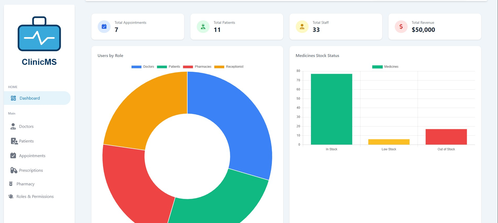
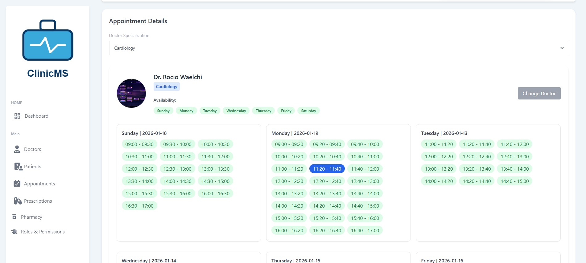
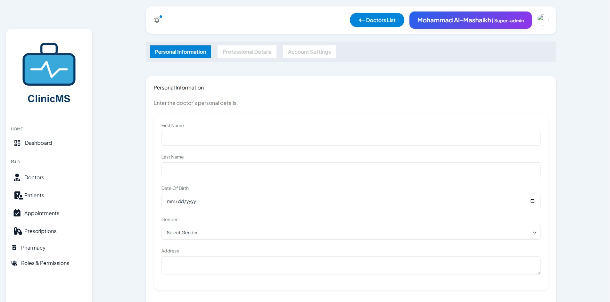

# 🏥 ClinicMS – Clinic Management System

A full-featured **Clinic Management System** built with **Laravel**, **Livewire**, and **Tailwind CSS**. ClinicMS is designed to manage clinic workflows efficiently, supporting **multiple user roles** such as Admins, Doctors, Patients, and Pharmacists.

The system covers the full medical cycle: patient registration, appointment scheduling, diagnosis, and pharmacy processing.

---

## 📸 UI Preview

> *(Add screenshots here)*

```md



```

---

## ✨ Features

### 👥 Multi-Role System

* **Admin**

  * Manage users (doctors, patients, pharmacists)
  * Assign roles and permissions
  * Oversee system activity

* **Doctor**

  * View assigned appointments
  * Diagnose patients
  * Create medical records
  * Send prescriptions to pharmacy

* **Patient**

  * Register & manage profile
  * Book appointments with doctors
  * View medical history

* **Pharmacy**

  * Receive prescriptions from doctors
  * Process medications for patients

---

## 🗓️ Appointment Management

* Patients select available doctors
* Appointment booking with date & time
* Doctors can view and manage schedules
* Status tracking (pending, completed, cancelled)

---

## 🩺 Medical Records & Diagnosis

* Doctors can assign diseases/diagnosis to patients
* Medical records are linked to patient profiles
* Secure and structured data handling

---

## 💊 Pharmacy Workflow

* Doctors send prescriptions directly to pharmacy
* Pharmacy receives patient medication requests
* Status updates after medication preparation

---

## 🛠️ Tech Stack

* **Laravel**
* **Livewire**
* **Tailwind CSS**
* **MySQL**
* **Blade Components**
* **Laravel Authentication**

---


## 🚀 Installation & Setup

### 1️⃣ Clone the repository

```bash
git clone https://github.com/MohammadMashaikh/ClinicMs.git
cd clinicms
```

---

### 2️⃣ Install dependencies

```bash
composer install
npm install
npm run build
```

---

### 3️⃣ Environment setup

```bash
cp .env.example .env
php artisan key:generate
```

Set your database credentials in `.env`.

---

### 4️⃣ Run migrations

```bash
php artisan migrate --seed
```

---

### 5️⃣ Start the server

```bash
php artisan serve
```

---

## 🔐 Authentication & Authorization

* Role-based access control
* Middleware-protected routes
* Secure access to medical data

---

## 🎨 UI & UX

* Built with **Tailwind CSS**
* Responsive dashboards
* Glassmorphism-inspired UI
* Optimized for both desktop and tablet use

---

## 📌 Notes

* Designed for clinics and small medical centers
* Clean separation of responsibilities per role
* Livewire ensures reactive UI without heavy JavaScript
* Easily extendable for labs, billing, or reports

---

## 🧑‍💻 Author

**Mohammad Mashaikh**

---

## 📄 License

This project is open-source and available under the **MIT License**.
